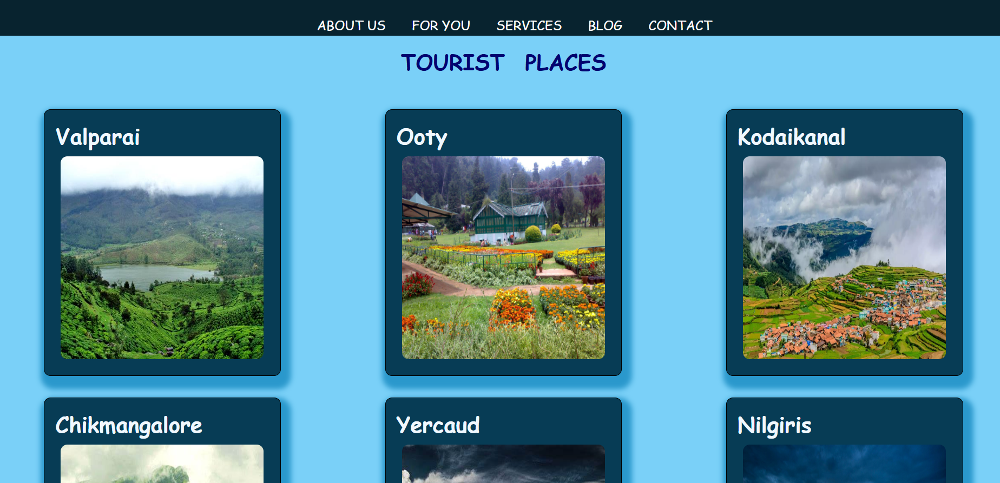

# Tourist Places

Welcome to the **Tourist Places** project! This React application is designed to showcase some of the most famous tourist hotspots around the world. Explore these destinations, learn more about them, and get inspired for your next adventure!

 <p align="center">
   
 </p>

## Features

- **Explore Hotspots:** Browse through a curated list of famous tourist destinations.
- **Detailed Information:** View detailed information about each hotspot.
- **Interactive UI:** User-friendly interface with a responsive design.

## Technologies Used

- **React.js:** For building the user interface.
- **CSS:** For styling the application.
- **React Router:** For routing and navigation.


## Getting Started

To get a local copy up and running follow these simple steps:

### Prerequisites

- Node.js and npm installed on your machine.

### Installation

1. **Clone the repository:**

   ```bash
   git clone https://github.com/yourusername/tourist-places.git
2. **Navigate to the project directory:**
   cd tourist-places
3. **Install dependencies:**
   npm install
4.**Start the development server:**
   npm start
The application will be running at http://localhost:3000.

